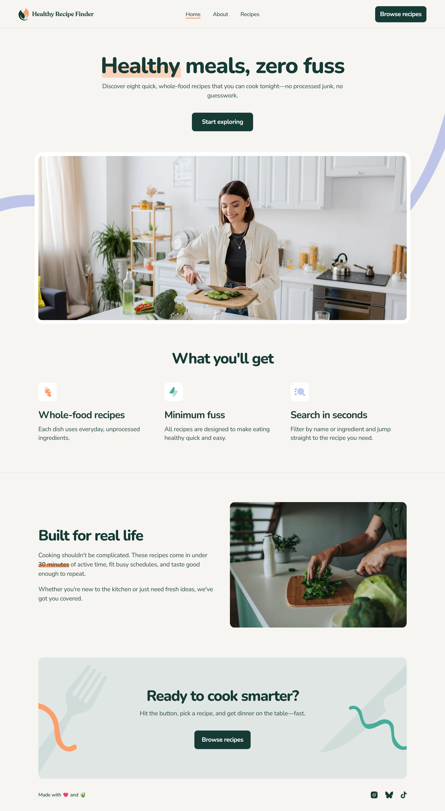

# Frontend Mentor - Recipe finder website solution

This is a solution to the [Recipe finder website challenge on Frontend Mentor](https://www.frontendmentor.io/challenges/recipe-finder-website--Ui-TZTPxN).

## Overview

### The challenge

Users should be able to:

- View the home, about, recipes index, and recipe detail pages
- Search for recipes by name or ingredient
- Filter recipes by max prep or cook time
- View the optimal layout for the interface depending on their device's screen size
- See hover and focus states for all interactive elements on the page

### Screenshot

### Links

- Solution URL: [Add solution URL here](https://your-solution-url.com)
- Live Site URL: [Add live site URL here](https://your-live-site-url.com)

## My process

### Built with

- Semantic HTML5 markup
- CSS custom properties
- Flexbox
- CSS Grid
- Mobile-first workflow
- Tailwindcss

### What I learned

This is my first project using Tailwindcss

## Acknowledgments

I leared tailwind by watching the following youtube videos

- JavaScript Mastery channel: https://www.youtube.com/watch?v=6biMWgD6_JY&t=2037s&pp=0gcJCfwJAYcqIYzv
- Web Dev Simplified channel: https://www.youtube.com/watch?v=x1RJ5Q09PqM
- chatGPT was really helpful reviewing my code especially JS codes
